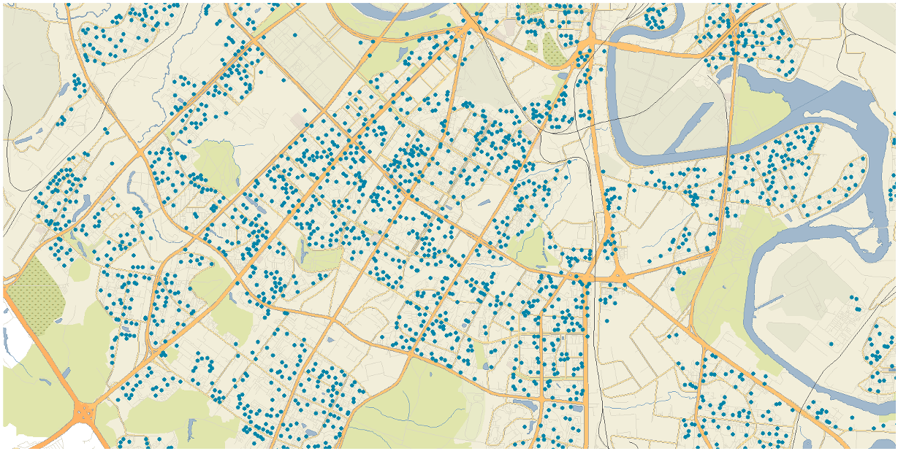
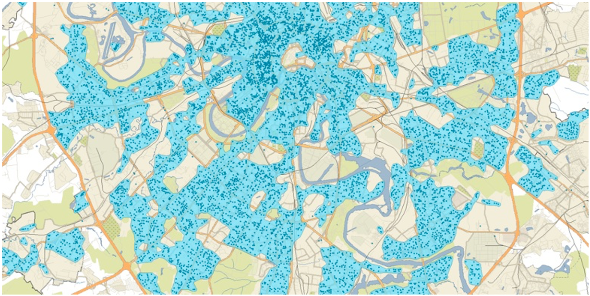
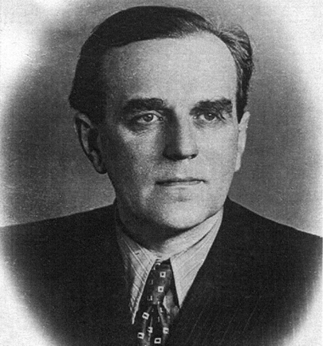
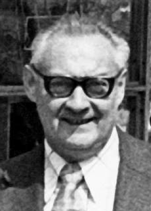
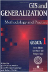

```{r setup, include=FALSE}
library(sf)
library(dplyr)
library(ggplot2)
knitr::opts_chunk$set(echo = FALSE, out.width = '100%', dpi = 600)
land = st_read('/Volumes/Data/Spatial/Natural Earth/natural_earth_vector.gpkg','ne_110m_land')
```

## Генерализация

.green[__Картографическая генерализация__ — это отбор, обобщение, выделение главных типических черт изображаемых объектов в ссответствии с назначением, масштабом, содержанием карт, особенностями картографируемой территории и самого объекта, степенью их изученности.]

.small[Берлянт А. М. КАРТОГРАФИЧЕСКАЯ ГЕНЕРАЛИЗАЦИЯ // Большая российская энциклопедия. Электронная версия (2016); https://bigenc.ru/geography/text/2049493 Дата обращения: 03.09.2021]

Различные процедуры генерализации применяются для обеспечения:
- Наглядности и читаемости
- Скорости отображения
- Познавательности

---

## Генерализация

```{r, out.width = "950px", fig.cap="Обеспечение читаемости изображения, приведение его детализации в соответствии с масштабом карты"}
knitr::include_graphics("img/talk2/visibility.png")
```

---

## Генерализация

```{r, out.width = "400px"}


```

Повышение скорости загрузки, визуализации, формирования подписей, кэширования и анализа данных.

---

## Генерализация

```{r, out.width = "800px"}

```

Ключ к пониманию закономерностей размещения явления, выявления пространственных рисунков и кластеров, которые не видны в масштабе самого явления

---

## Генерализация

```{r, out.width = "800px"}

```

Ключ к пониманию закономерностей размещения явления, выявления пространственных рисунков и кластеров, которые не видны в масштабе самого явления

---

## Генерализация

```{r, out.width = "800px"}

```

Ключ к пониманию закономерностей размещения явления, выявления пространственных рисунков и кластеров, которые не видны в масштабе самого явления

---

## Генерализация

```{r, out.width = "800px"}

```

Ключ к пониманию закономерностей размещения явления, выявления пространственных рисунков и кластеров, которые не видны в масштабе самого явления

---

## Открытие генерализации

.left-column[
```{r, out.width = "200px", fig.cap="Eckert Friedrich Eduard Max. 10.4.1868 Chemnitz - 26.12.1938 Aachen"}

```
]

.right-column[
.large[Первенство в выделении генерализации как особого метода в картографии принадлежит немецкому картографу Максу Эккерту (1921).]

Основной труд Эккерта по картографии издан в двух томах в 1921 и 1925 гг:

.green[__„Die Kartenwissenschaft. Forschungen und Grundlagen zu einer Kartographie als Wissenschaft“__] — _Картографическая наука. Исследования и основы картографии как науки_

Эккерт считается основоположником картографии как академической дисциплины. Ему также принадлежат 6 известных проекций, которые обзначаются как _Eckert I-VI_
]

---

## Die Kartenwissenschaft

.left-column[
```{r, out.width = "200px", fig.cap="Eckert, M., 1921. Die Kartenwissenschaft. Walter de Gruyter & Co, Berlin, Leipzig."}

```
]

.right-column[
Труд Эккерта включает _1520_ страниц, более _1000_ библиографических ссылок, более _2000_ ссылок на карты

- Эккерт впервые комплексно рассмотрел все аспекты современной на тот момент картографии, включая ранее игнорируемые темы, такие как тематическая картография. 

- Работа в основном содержит описательную систематизацию эмпирического опыта (_best practices_) и лишь незначительно углубляется в теорию картографии в части изображения рельефа и картографических проекций.

- Более глубокое теоретическое обощение на тот момент не было возможно, поскольку общие теории, такие как семиотика, теория информации и коммуникации, еще не были развиты в достаточной степени.
]

---

## Проекции Эккерта

```{r, fig.height = 3}
box = st_bbox(c(xmin = -180, xmax = 180, ymax = -90, ymin = 90), crs = st_crs(4326)) %>% 
  st_as_sfc() %>% 
  smoothr::densify(20)

plots = lapply(1:6, function(num) {
  prj = glue::glue('+proj=eck{num}')
  ggplot() +
    geom_sf(data = st_transform(land, prj), fill = 'darkgrey', size = 0) +
    geom_sf(data = st_transform(box, prj, desired_accuracy = 1), color = 'black', fill = NA, size = 0.2) +
    scale_y_continuous(breaks = -3:3 * 30) +
    scale_x_continuous(breaks = -6:6 * 30) +
    labs(title = glue::glue('Eckert {as.roman(num)}')) +
    theme_minimal() + 
    theme(text = element_text(family = "Open Sans", color = "grey20"),
          axis.text.y = element_blank(),
          panel.ontop = TRUE,
          plot.title = element_text(size = 12, hjust = 0.5, margin = margin(0,0,0,0)),
          panel.grid.major = element_line(color = "black", size = 0.2))
})
patchwork::wrap_plots(plots, ncol = 3)
```


---

## Модель Салищева

.left-column[
```{r, out.width = "100%", fig.cap="Константин Салищев (1903-1988)"}

```
]

.right-column[

.large[Впервые виды генерализации были тщательно изучены и систематизированы К.А.Салищевым]

- __Salistschew, K. A.__, (1967) _Einführung in die Kartographie. 2nd ed_., Geographisch-Kartographische Anstalt Gotha, Leipzig: VEB Hermann Haack.

- __Salichtchev, K. A.__, (1976) _History and Contemporary Development of Cartographic Generalization_, In: International Yearbook of Cartography. Bonn: Kirschbaum, pp. 158–172.

]

---

## Модель Салищева

1939 — «__Основы картоведения__». Параграф «О генерализации карт» (80-83). .red[Общие рассуждения о генерализации, нет классификации]

1947 — «__Составление и редактирование карт__». Глава «Картографическая генерализация» (76-150). .red[Систематизированы виды, факторы генерализации. Множество примеров генерализации конкретных явлений (реки, озера, горизонтали, населенные пункты и т.д.)].

1955 — «__Картография__» (соавт. А.В.Гедымин) Параграф «Картографическая генерализация» (15-22). .red[Систематизированы виды, факторы генерализации. Выделен баланс геометрической точности и содержательного соответствия].

1966 — «__Картография__» Глава «Картографическая генерализация» (91-107). .red[Обобщена генерализация явлений разной локализации]

---

## Картоведение (1976)

.left-column[
```{r, out.width = "100%", fig.cap="1982, 1990 — 2-е и 3-е издание"}
knitr::include_graphics("img/talk2/cartov.png")
```
]

.right-column[
__Систематическое изложение модели генерализации:__
- Сущность и факторы
- Влияние знаков
- Генерализация явлений разной локализации
- Математическое обоснование

__Виды генерализации:__ 
- Отбор
- Геометрическая генерализация
- Обобщение характеристик (качественных и количественных)
- Переход от простых понятий к сложным
]

---

## Картоведение (1976)

.left-column[
```{r, out.width = "100%", fig.cap="1982, 1990 — 2-е и 3-е издание"}
knitr::include_graphics("img/talk2/cartov.png")
```
]

.right-column[

### Черты модели Салищева

- Высокий уровень абстракции (виды генерализации)

- Концептуализация на уровне явлений, а не отдельных объектов

- Учет взаимного влияния способов изображения и генерализации

- Дополнительный процесс отбора подписей

- Геометрическая точность и содержательная верность

]

---

## Модели генерализации

.left-column[
```{r, out.width = "200px", fig.cap="Lech Ratajski (1921-1977)"}

```
]

.right-column[
.large[__1967__ — Польский картограф Лех Ратайский предлагал разделять качественную и количественную генерализацию]

__Ratajski, L.__, (1967) _Phenomenes des points de generalisation_, International Yearbook of Cartography, 7, 143–151.

]

---

## Модель Ратайского

.left-column[
__Ratajski, L.__, (1967) _Phenomenes des points de generalisation_, International Yearbook of Cartography, 7, 143–151.
]

.right-column[
```{r, out.width = "650px", fig.cap=""}
knitr::include_graphics("img/talk2/RatajskiModel.png")
```
]

---

## Модели генерализации

.left-column[
```{r, out.width = "200px", fig.cap="Joel L. Morrison, Professor Emeritus, Ohio State University"}

```
]

.right-column[

.large[__1974__ — Американский картограф Джоэл Моррисон предложил модель генерализации, основанную на теории множеств]

__Morrison, J. L.__, (1974) _A theoretical framework for cartographic generalization with emphasis on the process of symbolization_, International Yearbook of Cartography, 14, 115–127.

]

---

## Модель Моррисона

```{r, out.width = "800px", fig.cap=""}

```

__Morrison, J. L.__, (1974) _A theoretical framework for cartographic generalization with emphasis on the process of symbolization_, International Yearbook of Cartography, 14, 115–127.


---

## Диалог Морриссон — Салищев

```{r, out.width = "600px"}

```

---

## Диалог Морриссон — Салищев

```{r, out.width = "550px"}

```

---

## Диалог Морриссон — Салищев

```{r, out.width = "500px"}

```

---

## Диалог Морриссон — Салищев

```{r, out.width = "600px"}

```

---

## Модели генерализации

.left-column[
```{r, out.width = "200px", fig.cap="Bradford G. Nickerson Professor Emeritus, University of New Brunswick"}

```
]

.right-column[

.large[__1988__ — Канадский картограф Брэдфорд Никерсон предложил модель на основе правил]
- Модификация объектов.
- Масштабирование символов.
- Смещение объектов.
- Уменьшение масштаба.
- Размещение подписей.

.small[__Nickerson, B. G., and Freeman, H.__, (1986) _Development of a Rule-Based System for Automatic Map Generalization_, Proceedings of the Second International Symposium on Spatial Data Handling, Seattle, Washington, July 5–10, pp. 537–556.]

]

---

## Модель Никерсона-Фримена

```{r, out.width = "1000px", fig.cap=""}

```

.small[__Nickerson, B. G., and Freeman, H.__, (1986) _Development of a Rule-Based System for Automatic Map Generalization_, Proceedings of the Second International Symposium on Spatial Data Handling, Seattle, Washington, July 5–10, pp. 537–556.]

---

## Модели генерализации

.left-column[
```{r, out.width = "100%", fig.cap="Kurt Brassel, Professor Emeritus, University of Zurich"}

```
]

.right-column[

.large[__1988__ —  Курт Брассель и Роберт Вайбель (Швейцария) предложили модель на основе библиотеки процессов]

__Brassel, K. E., and Weibel, R.__, (1988) _A Review and Conceptual Framework of Automated Map Generalization_, International Journal of Geographical Information Systems, 2(3), 229–244.

]

---

## Модель Брасселя-Вайбеля

.left-column[
__Brassel, K. E., and Weibel, R.__, (1988) _A Review and Conceptual Framework of Automated Map Generalization_, International Journal of Geographical Information Systems, 2(3), 229–244.
]

.right-column[
```{r, out.width = "650px", fig.cap=""}

```
]

---

## Модели генерализации

.left-column[
```{r, out.width = "100%", fig.cap="Robert McMaster, Professor of Geography, University of Minnesota"}

```
]

.right-column[

.large[__1988__ —  МакМастер и Ши (США) предложили модель, в которой логика генерализации разделена на три аспекта]

- Причины генерализации
- Оценка контекста
- Операторы трансформации

.small[__McMaster, R. B., and Shea, K. S.__, (1988) _Cartographic Generalization in a Digital Environment: A Framework for Implementation in a Geographic Information System_, GIS/LIS’88 Proceedings, San Antonio, Texas, November 30 – December 2, pp. 240–249.]

]

---

## Модель МакМастера-Ши

.left-column[
__McMaster, R. B., and Shea, K. S.__, (1988) _Cartographic Generalization in a Digital Environment: A Framework for Implementation in a Geographic Information System_, GIS/LIS’88 Proceedings, pp. 240–249.
]

.right-column[
```{r, out.width = "450px", fig.cap=""}

```
]

---

## Модель МакМастера-Ши

.left-column[
__McMaster, R. B., and Shea, K. S.__, (1988) _Cartographic Generalization in a Digital Environment: A Framework for Implementation in a Geographic Information System_, GIS/LIS’88 Proceedings, pp. 240–249.
]

.right-column[
```{r, out.width = "670px", fig.cap=""}

```
]

---

## Модель МакМастера-Ши

.left-column[
__McMaster, R. B., and Shea, K. S.__, (1988) _Cartographic Generalization in a Digital Environment: A Framework for Implementation in a Geographic Information System_, GIS/LIS’88 Proceedings, pp. 240–249.
]

.right-column[
```{r, out.width = "520px", fig.cap=""}

```
]

---

## Модель МакМастера-Ши

.left-column[
__McMaster, R. B., and Shea, K. S.__, (1988) _Cartographic Generalization in a Digital Environment: A Framework for Implementation in a Geographic Information System_, GIS/LIS’88 Proceedings, pp. 240–249.
]

.right-column[
```{r, out.width = "550", fig.cap=""}

```
]

---

## Модели генерализации

.left-column[
```{r, out.width = "100%", fig.cap="Mark Monmonier Distinguished Professor Syracuse University"}

```
]

.right-column[

.large[__1989__ —  МакМастер и Монмонье (США) предложили модель растровой генерализации, в которой выделили 4 категории трансформаций:]

- Структурная
- Количественная
- Количественно-категорийная
- Категорийная

.small[__McMaster, R. B., Monmonier, M. S.__, (1989) _A conceptual framework for quantitative and qualitative raster-mode generalization_, Proceedings of GIS/LIS ’89, Orlando, Florida, 2, pp. 390–403.]

]

---

## Модель МакМастера-Монмонье

.left-column[
__McMaster, R. B., Monmonier, M. S.__, (1989) _A conceptual framework for quantitative and qualitative raster-mode generalization_, Proceedings of GIS/LIS ’89, Orlando, Florida, 2, pp. 390–403.
]

.right-column[
```{r, out.width = "850px", fig.cap=""}

```
]

---

## Модель операторов трансформации

```{r, out.width = "650px", fig.cap=""}

```

Roth, R.E., Brewer, C.A., Stryker, M.S., 2011. A typology of operators for maintaining legible map designs at multiple scales. Cartographic Perspectives 29–64. https://doi.org/10.14714/CP68.7


---

## Литература

### 1991

.left-column[
```{r, out.width = "100%"}
knitr::include_graphics("img/talk2/t1_gen1991.png")
```
]

.right-column[
**Buttenfield, B.P. and McMaster, R.B.** (Eds.) *Map Generalization: Making Rules for Knowledge Representation.* New York: Longman. (1st Printing, 1991; 2nd Printing 1994 Longman Scientific; 3rd printing 1999 Internet-Print-on-Demand: Wiley & Sons).
]

---

## Литература

### 1995

.left-column[
```{r, out.width = "100%"}

```
]

.right-column[
**Muller, J-C., Lagrange, J.-P. & Weibel, R.** (eds.). *GIS and Generalization: Methodology and Practice.* London: Taylor & Francis, 1995.
]

---

## Литература

### 2006

.left-column[
```{r, out.width = "100%"}

```
]

.right-column[
**Li, Z.** *Algorithmic foundation of multi-scale spatial representation*. CRC Press, 2006. 281 p.
]

---

## Литература

### 2007

.left-column[
```{r, out.width = "100%"}
knitr::include_graphics("img/talk2/t1_gen2007.png")
```
]

.right-column[
**Mackaness, W. A., Ruas, A. & Sarjakoski, L. T.**  (eds.)
*Generalisation of Geographic Information: Cartographic Modelling and Applications.* Amsterdam: Elsevier, 2007, 370 p.
]

---

## Литература

### 2014

.left-column[
```{r, out.width = "100%"}
knitr::include_graphics("img/talk2/t1_gen2014.png")
```
]

.right-column[
**Burghardt D., Duchene C. and Mackaness W.** (eds.). *Abstracting Geographic Information in a Data Rich World.* Lecture Notes in Geoinformation and Cartography series, Springer-Verlag, Berlin, Germany, 2014
]

---

## Литература

### 2019

.left-column[
```{r, out.width = "100%"}
knitr::include_graphics("img/talk2/t1_gen2019.png")
```
]

.right-column[
**Yan H.** *Description Approaches and Automated Generalization Algorithms for Groups of Map Objects* Singapore: Springer-Singapore, 2019, 228 p.
]

