```{r setup, include=FALSE}
library(knitr)
opts_chunk$set(echo = FALSE)
```

## Алгоритмы редуцирования точек

1. __Глобальность__ — линия подвергается обработке целиком, без разделения на сегменты.

2. __Точечность__ — фактическим объектом анализа являются вершины линии, а не сама линия. Процесс генерализации предваряется определением значимости каждой вершины.

3. __Консервативность__ — новые вершины в линию не добавляются, существующие не смещаются, происходит только удаление исходных вершин. Множество вершин упрощенной линии является подмножеством множества исходных вершин.

4. __Нетопологичность.__ Каждая линия подвергается геометрическому упрощению без учета ее топологических отношений с другими объектами — точками, линиями, полигонами. Как внутри текущего слоя, так и по отношению к объектам других слоев. 

---

## Последовательные алгоритмы

1. Начинают в первой точке

2. Последовательно движутся, пропуская точки, до тех пор пока вычисляемая метрика не достигнет значимого значения

3. Точка, в которой метрика достигла значимого значения, становится опорной, добавляется в результат.

4. Процедура продолжается относительно выбранной точки и т.д.

---

## Последовательные алгоритмы

.pull-left[
Количество точек
```{r}
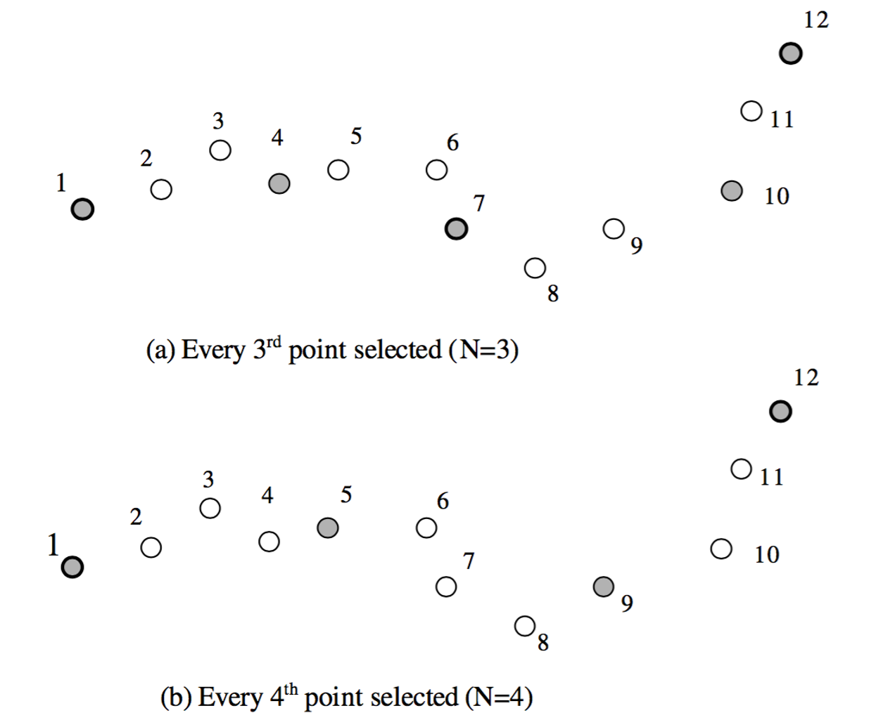
```
]

.pull-right[
Расстояние
```{r}
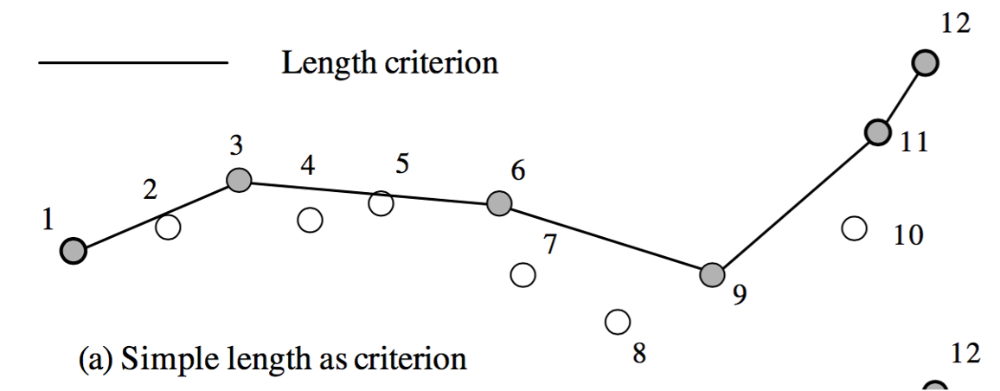
```

Кумулятивное расстояние
```{r}
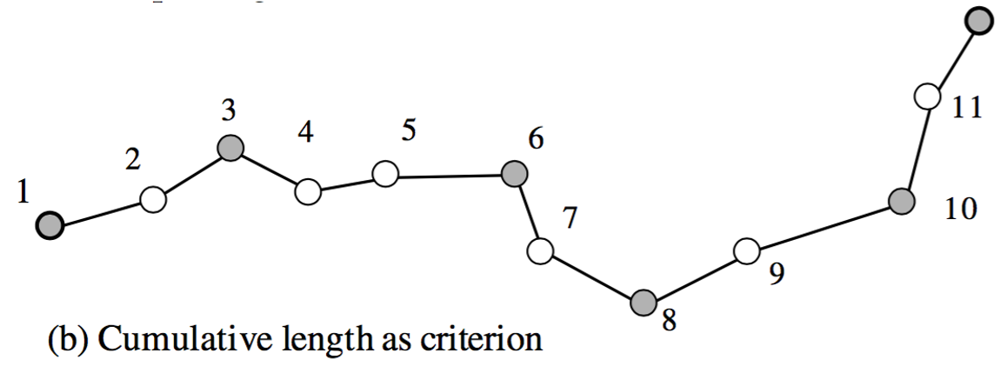
```
]

---

## Последовательные алгоритмы

.left-40[
Угол поворота
```{r}
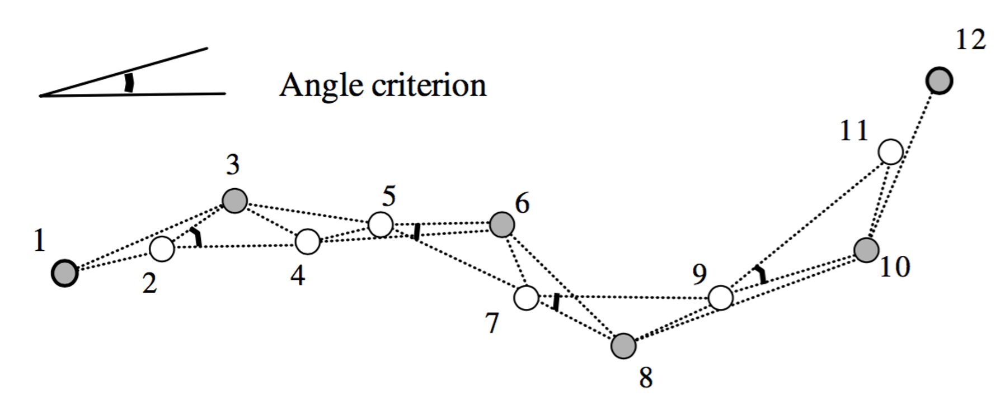
```
]

.right-60[
Перпендикулярное расстояние
```{r}
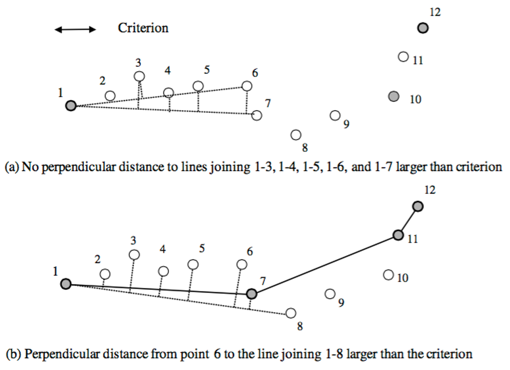
```
]

---

## Итеративные алгоритмы

1. Определяется точка, имеющая наибольшую значимость по выбранной метрике. Добавляется в результат. Выполняются необходимые перестроения

2. Среди оставшихся определяется следующая по значимости точка, с учетом уже добавленных точек, добавляется в результат. Выполняются необходимые перестроения

3. Процесс продолжается до тех пор пока все оставшиеся точки имеют значимость ниже пороговой

> Процедура может быть реализована наоборот: путем поиска и удаления наименее значимых точек

---

## Итеративные алгоритмы

.pull-left[
.large[Расстояние до стягивающей хорды (алгоритм Дугласа-Пейкера)]

Douglas, D. H., & Peucker, T. K. (1973). Algorithms for the reduction of the number of points required to represent a digitized line or its caricature. The Canadian Cartographer, (10(2)), 112–122.
]

.pull-right[
```{r}
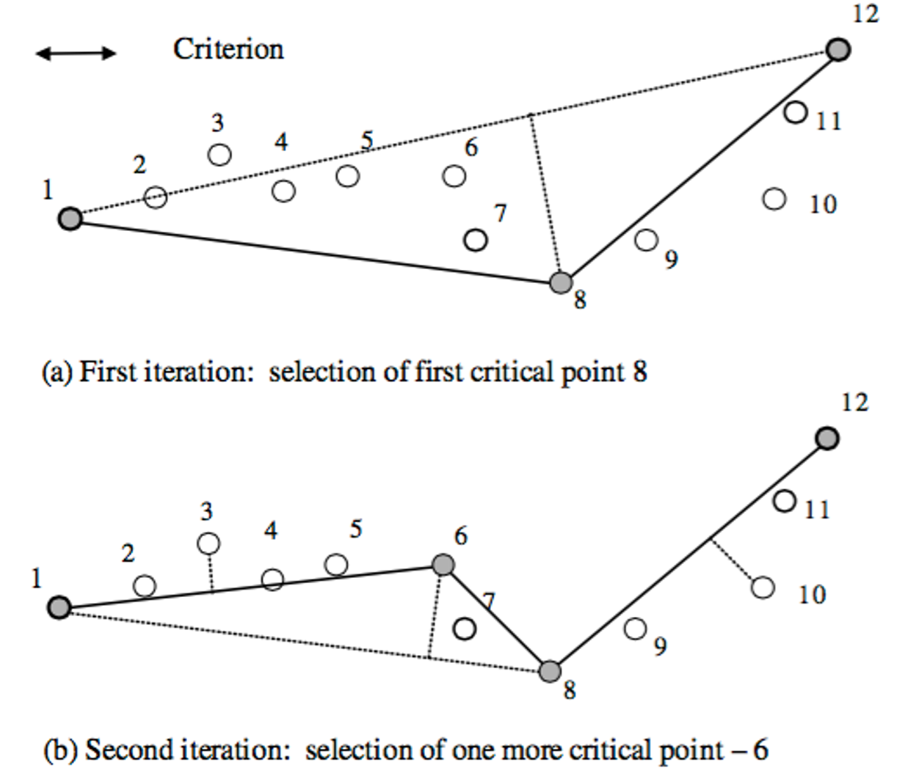
```
]

---

## Итеративные алгоритмы

.left-40[
.large[Площадь триплета (алгоритм Висвалингам-Уайатта)]

Visvalingam, M., & Whyatt, J. D. (1993). Line generalisation by repeated elimination of points. The Cartographic Journal, 30(1), 46–51. https://doi.org/10.1179/caj.1993.30.1.46
]

.right-60[
```{r}
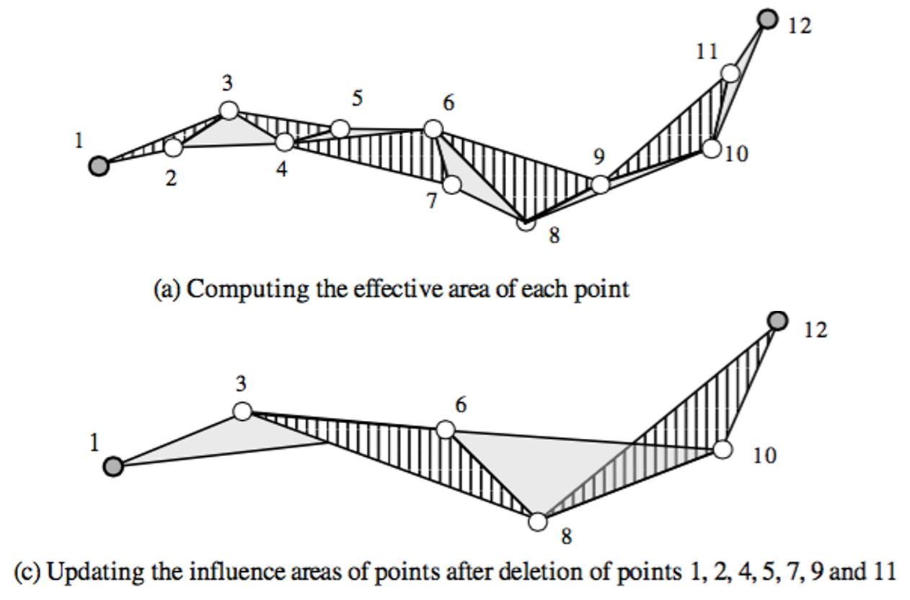
```
]

---

## Алгоритм Ли-Оупеншоу

Минимальный видимый элемент (квадрат)

.pull-left[
1) На линии накладывается сетка разрешения R<br>
2) Линия разбивается квадратами на сегменты 

```{r, out.width='70%'}
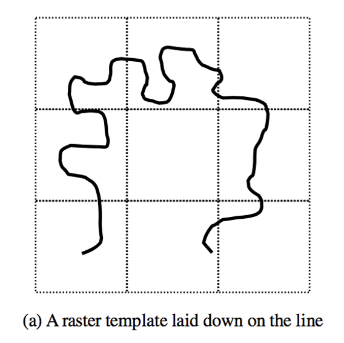
```
]

.pull-right[
3) Для каждого сегмента выбирается репрезентативная точка<br>
4) Линия восстанавливается из репрезентативных точек

```{r, out.width='70%'}
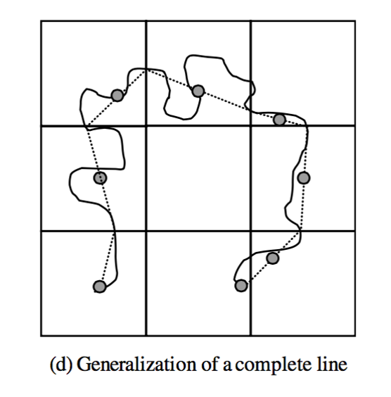
```
]

---

## Алгоритм Ли-Оупеншоу

Методы вычисления репрезентативной точки

- Точка пересечения с линией сетки

- Середина отрезка, соединяющего точку входа и выхода

- Среднее арифметическое точек внутри ячейки (кластер)

- ...

Li, Z., & Openshaw, S. (1992). Algorithms for automated line generalization based on a natural principle of objective generalization. International Journal of Geographical Information Systems, 6(5), 373–389. https://doi.org/10.1080/02693799208901921

---

## Алгоритм Ли-Оупеншоу

Существует модификация с гексагональной решеткой:

```{r, out.width='60%'}
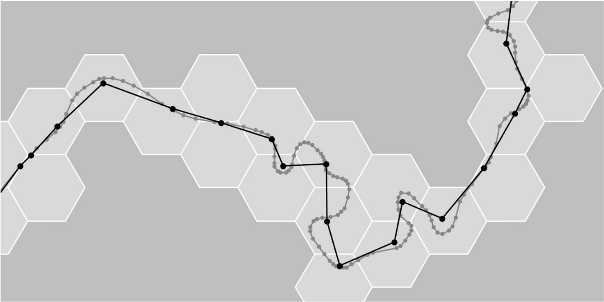
```

Raposo, P. (2013). Scale-specific automated line simplification by vertex clustering on a hexagonal tessellation. Cartography and Geographic Information Science, 40(5), 427–443. https://doi.org/10.1080/15230406.2013.803707

---

## Алгоритм Ванга-Мюллера

- Алгоритм основан на сегментации линии на изгибы и оценке их параметров.

- Изгиб определяется как участок линии, на котором угол поворота линии сохраняет свой знак.

```{r}
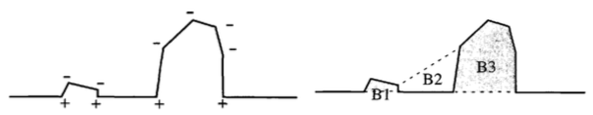
```

- Значимость изгиба определяется его площадью

Wang, Z., Müller, J. (1998). Line generalization based on analysis of shape characteristics. Cartography and Geographic Information, 25(1), 3–15.

---

## Алгоритм Ванга-Мюллера

.pull-left[
1. Малые по площади изгибы следует удалить

2. Рядом расположенные схожие изгибы следует объединить (размер, компактность)

3. Изолированные изгибы, размер которых близок к пороговому, следует преувеличить

Wang, Z., Müller, J. (1998). Line generalization based on analysis of shape characteristics. Cartography and Geographic Information, 25(1), 3–15.
]

.pull-right[
```{r, out.width='80%'}
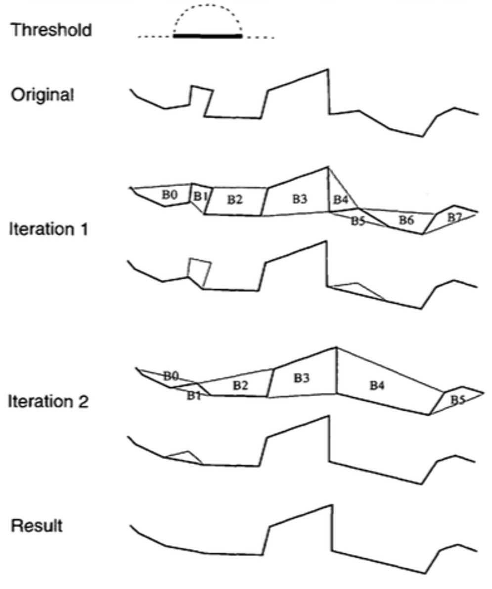
```
]

---

## Алгоритм Ванга-Мюллера

.pull-left[
1. Малые по площади изгибы следует удалить

2. Рядом расположенные схожие изгибы следует объединить (размер, компактность)

3. Изолированные изгибы, размер которых близок к пороговому, следует преувеличить

Wang, Z., Müller, J. (1998). Line generalization based on analysis of shape characteristics. Cartography and Geographic Information, 25(1), 3–15.
]

.pull-right[
```{r}
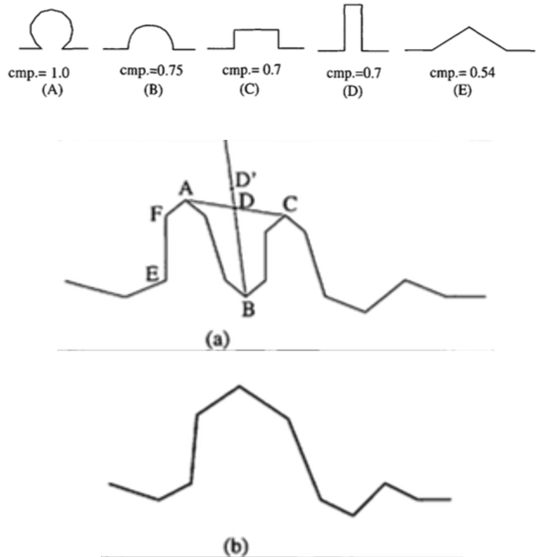
```
]

---

## Алгоритм Ванга-Мюллера

.pull-left[
1. Малые по площади изгибы следует удалить

2. Рядом расположенные схожие изгибы следует объединить (размер, компактность)

3. Изолированные изгибы, размер которых близок к пороговому, следует преувеличить

Wang, Z., Müller, J. (1998). Line generalization based on analysis of shape characteristics. Cartography and Geographic Information, 25(1), 3–15.
]

.pull-right[
__Преувеличение изгиба__
```{r}
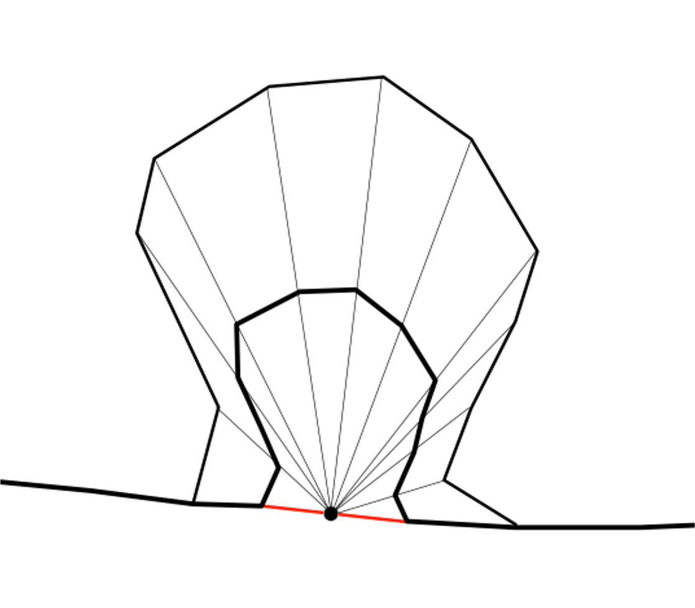
```
]

---

## Алгоритм на основе триангуляции

__[1]__ Построение триангуляции

```{r, out.width='70%'}
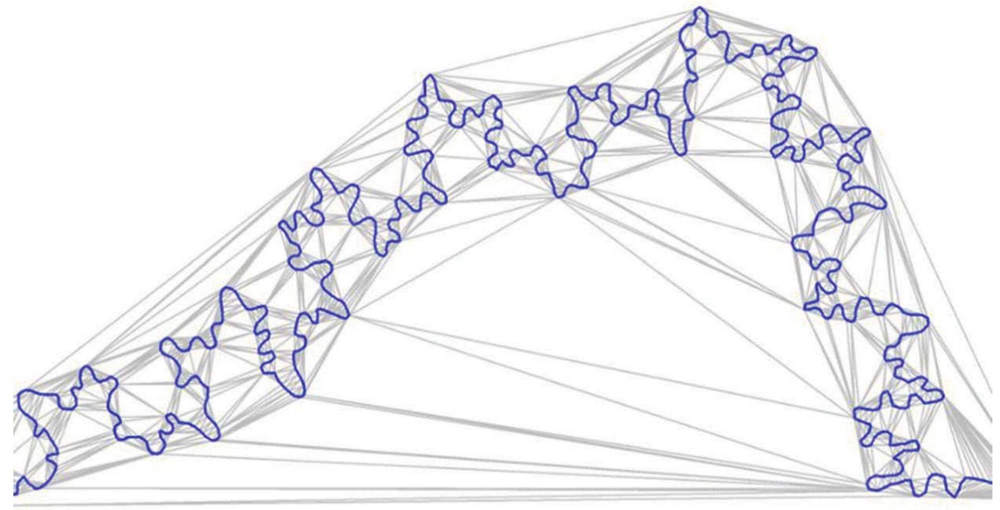
```

.vsmall[Ai, T., Ke, S., Yang, M., & Li, J. (2017). Envelope generation and simplification of polylines using Delaunay triangulation. International Journal of Geographical Information Science, 31(2), 297–319. DOI: 10.1080/13658816.2016.1197399]

---

## Алгоритм на основе триангуляции

__[2]__ Построение иерархии изгибов и классификация треугольников

```{r, out.width='80%'}
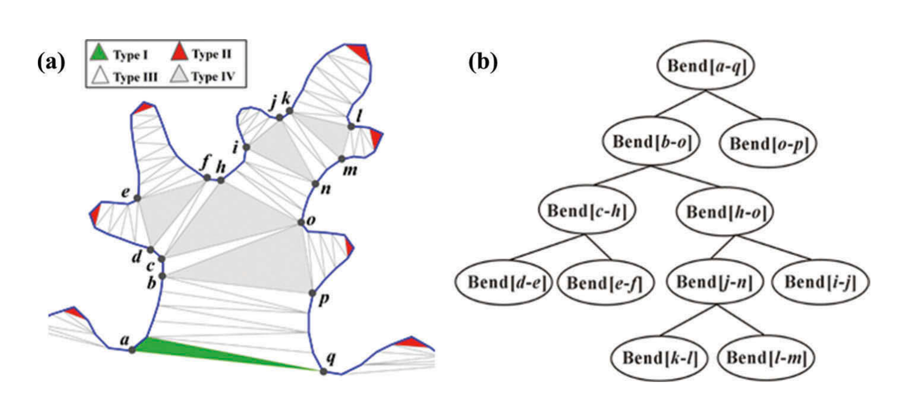
```

.vsmall[Ai, T., Ke, S., Yang, M., & Li, J. (2017). Envelope generation and simplification of polylines using Delaunay triangulation. International Journal of Geographical Information Science, 31(2), 297–319. DOI: 10.1080/13658816.2016.1197399]

---

## Алгоритм на основе триангуляции

.pull-left[
__[3]__ Оценка геометрических параметров изгибов

- Ширина изгиба (ho)

- Глубина изгиба (p-ck)

- Размер изгиба (площадь всех треугольников)

.vsmall[Ai, T., Ke, S., Yang, M., & Li, J. (2017). Envelope generation and simplification of polylines using Delaunay triangulation. International Journal of Geographical Information Science, 31(2), 297–319. DOI: 10.1080/13658816.2016.1197399]
]

.pull-right[
```{r, out.width='100%'}
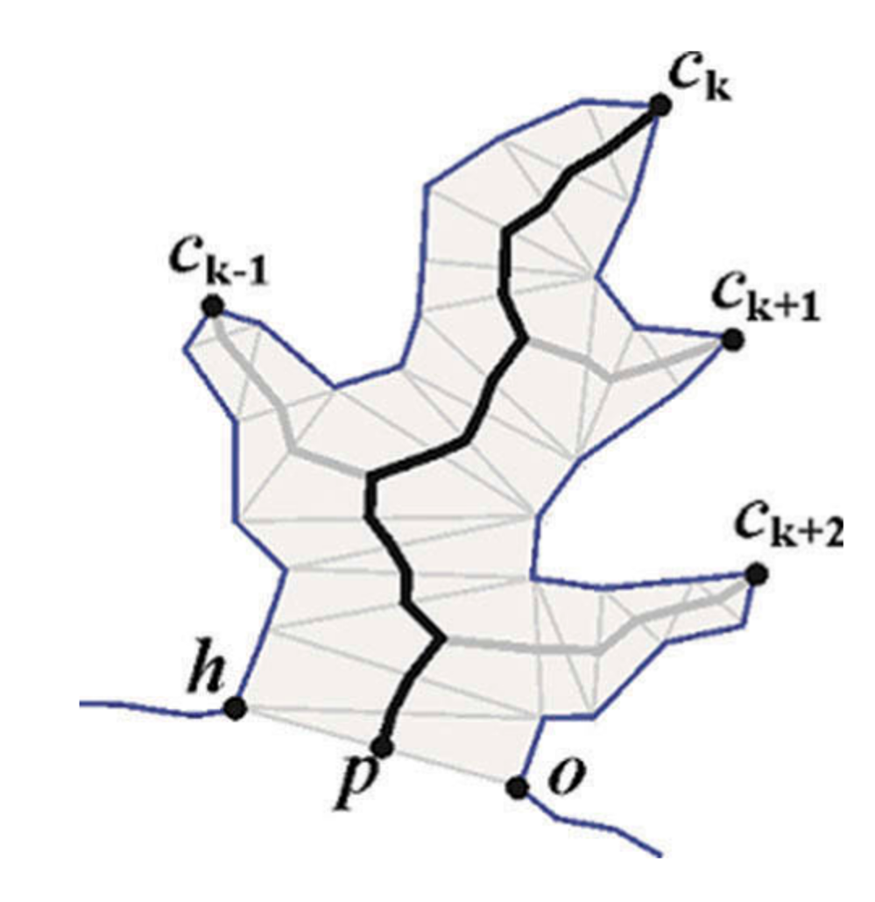
```
]

---

## Алгоритм на основе триангуляции

__[4]__ Выделение левых и правых изгибов малого размера

```{r, out.width='100%'}
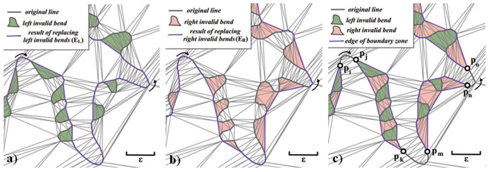
```

.vsmall[Ai, T., Ke, S., Yang, M., & Li, J. (2017). Envelope generation and simplification of polylines using Delaunay triangulation. International Journal of Geographical Information Science, 31(2), 297–319. DOI: 10.1080/13658816.2016.1197399]

---

## Алгоритм на основе триангуляции

__[4]__ Выделение левых и правых изгибов малого размера

```{r, out.width='70%'}
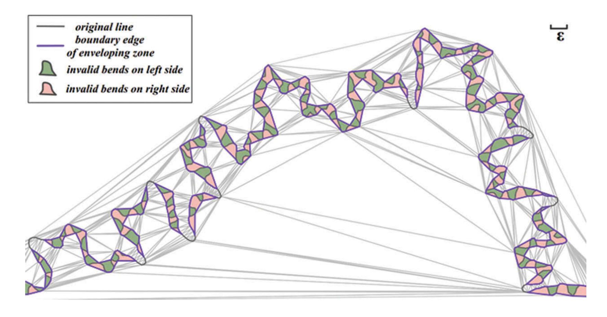
```

.vsmall[Ai, T., Ke, S., Yang, M., & Li, J. (2017). Envelope generation and simplification of polylines using Delaunay triangulation. International Journal of Geographical Information Science, 31(2), 297–319. DOI: 10.1080/13658816.2016.1197399]

---

## Алгоритм на основе триангуляции

.left-40[
__[5]__ Замещение

$$\mu = \frac{A_{BL} - A_{BR}}{A_{BL} + A_{BR}}$$

.vsmall[Ai, T., Ke, S., Yang, M., & Li, J. (2017). Envelope generation and simplification of polylines using Delaunay triangulation. International Journal of Geographical Information Science, 31(2), 297–319. DOI: 10.1080/13658816.2016.1197399]
]

.right-60[
```{r, out.width='95%'}
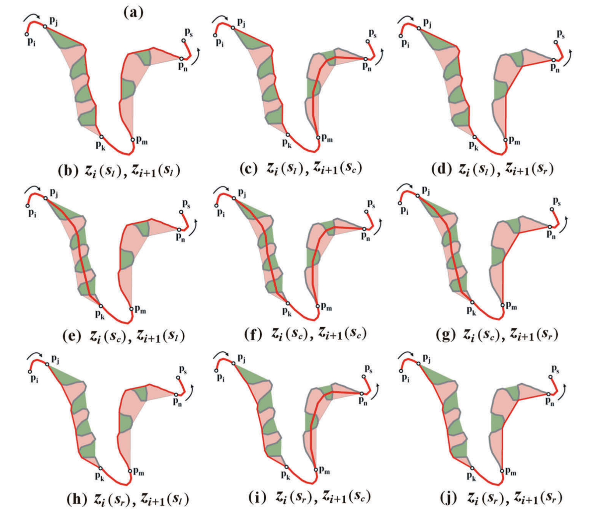
```
]

---

## Алгоритм на основе триангуляции

.left-40[
__[5]__ Замещение

$$\mu = \frac{A_{BL} - A_{BR}}{A_{BL} + A_{BR}}$$

.vsmall[Ai, T., Ke, S., Yang, M., & Li, J. (2017). Envelope generation and simplification of polylines using Delaunay triangulation. International Journal of Geographical Information Science, 31(2), 297–319. DOI: 10.1080/13658816.2016.1197399]
]

.right-60[
```{r, out.width='95%'}
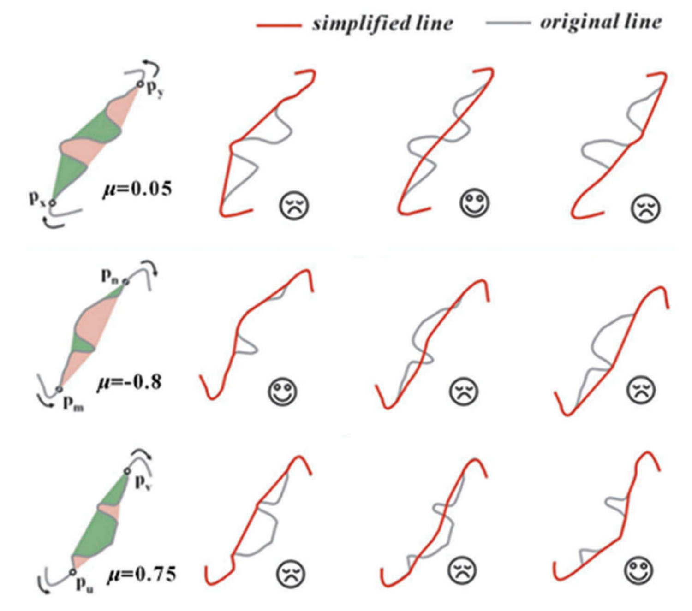
```
]

---

## Алгоритм на основе триангуляции

__[6]__ Результат

```{r, out.width='70%'}
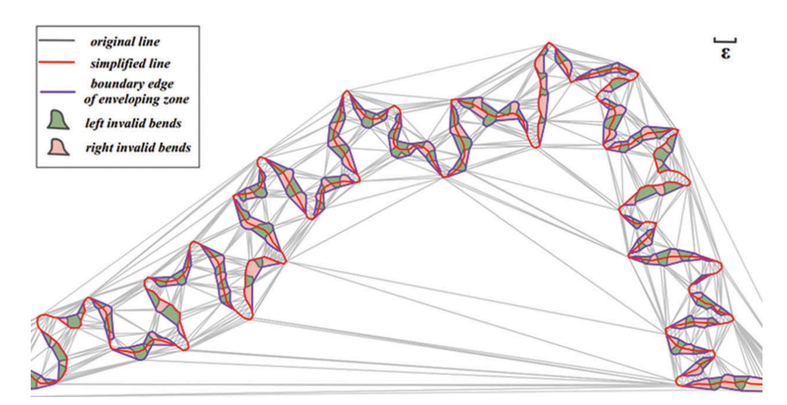
```

.vsmall[Ai, T., Ke, S., Yang, M., & Li, J. (2017). Envelope generation and simplification of polylines using Delaunay triangulation. International Journal of Geographical Information Science, 31(2), 297–319. DOI: 10.1080/13658816.2016.1197399]

---

## Алгоритм на основе триангуляции

__Иерархия изгибов__

```{r, out.width='70%'}
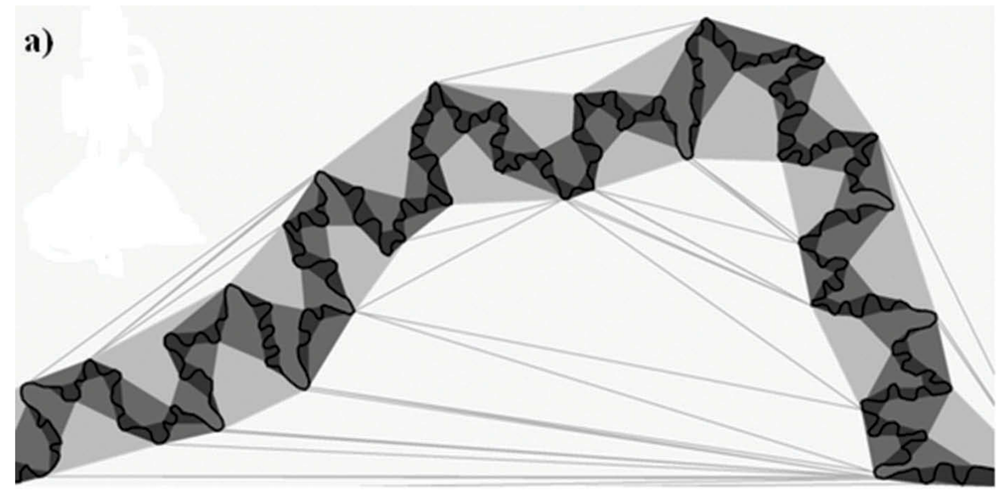
```

.vsmall[Ai, T., Ke, S., Yang, M., & Li, J. (2017). Envelope generation and simplification of polylines using Delaunay triangulation. International Journal of Geographical Information Science, 31(2), 297–319. DOI: 10.1080/13658816.2016.1197399]

---

## Алгоритм на основе триангуляции

__Примеры__

.left-60[
```{r, out.width='80%'}
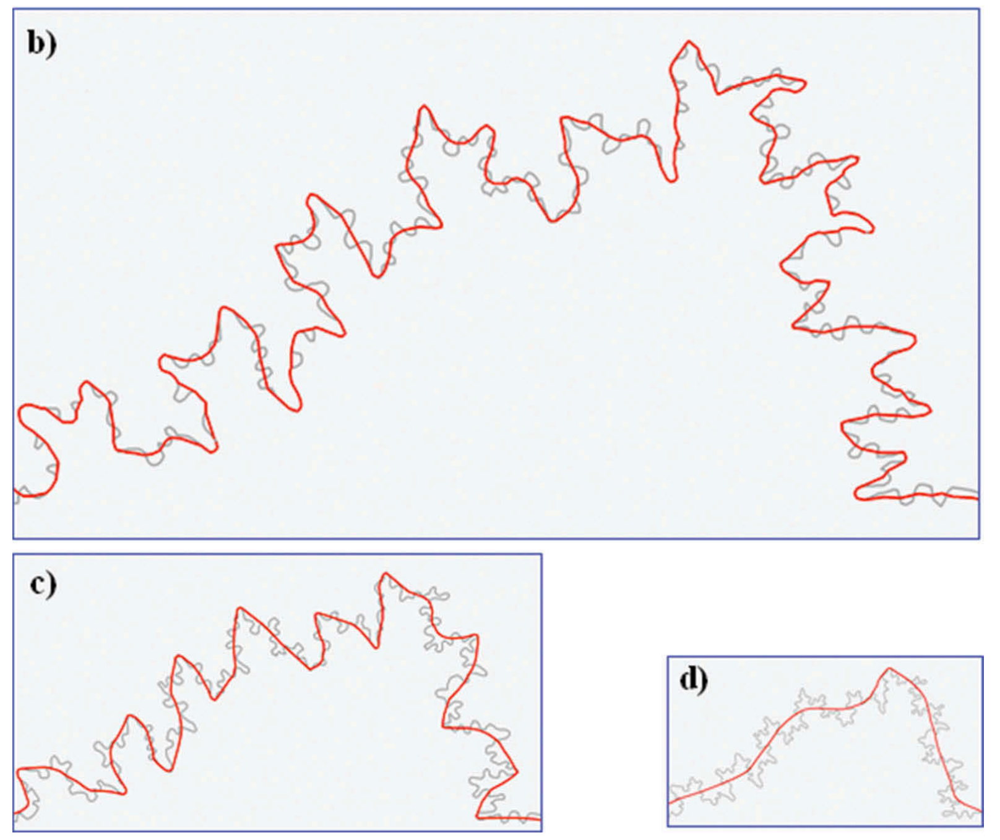
```
]

.right-40[
Ai, T., Ke, S., Yang, M., & Li, J. (2017). Envelope generation and simplification of polylines using Delaunay triangulation. International Journal of Geographical Information Science, 31(2), 297–319. DOI: 10.1080/13658816.2016.1197399
]

---

## Оценка геометрической точности

Модифицированное расстояние Хаусдорфа (MHD), может быть использовано как метрика оценки геометрической точности линий. 

Пусть даны два множества точек $\mathcal{A} = \lbrace a_1,...,a_{N_a} \rbrace$ и $\mathcal{B} = \lbrace b_1,...,b_{N_b} \rbrace$. Тогда среднее расстояние между $\mathcal{A}$ и $\mathcal{B}$ может быть вычислено как $\overline{d}(\mathcal{A},\mathcal{B}) = \frac{1}{N_a}\sum_{a \in \mathcal{A}}d(a,\mathcal{B})$, где $d(a, \mathcal{B}) = \min_{b \in \mathcal{B}}\lVert a - b \rVert$. Аналогично, обратное расстояние между $\mathcal{B}$ и $\mathcal{A}$ вычисляется как $\overline{d}(\mathcal{B},\mathcal{A}) = \frac{1}{N_b}\sum_{b \in \mathcal{B}}d(b,\mathcal{A})$, где $d(b, \mathcal{A}) = \min_{a \in \mathcal{A}}\lVert b - a \rVert$.

Имея прямое и обратное расстоения между $\mathcal{A}$ и $\mathcal{B}$, модифицированное расстояние Хаусдорфа MHD вычисляется как:

  $$
  	MHD(\mathcal{A}, \mathcal{B}) = max\big(\overline{d}(\mathcal{A},\mathcal{B}), \overline{d}(\mathcal{B},\mathcal{A})\big),
  $$

---

## Оценка геометрической точности

При оценке геометрической точности в качестве множеств $\mathcal{A}$ и $\mathcal{B}$ используются ребра исходного и генерализованного множеств линий соответственно. 

  $$
  	MHD(\mathcal{A}, \mathcal{B}) = max\big(\overline{d}(\mathcal{A},\mathcal{B}), \overline{d}(\mathcal{B},\mathcal{A})\big),
  $$

```{r mhd, out.width = "100%", echo = FALSE, out.width='80%'}
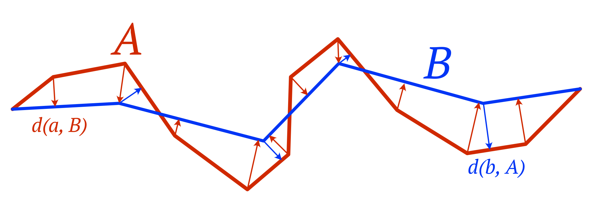
```

---

## Оценка геометрической точности

```{r mhd2, out.width = "100%", echo = FALSE, out.width='80%'}

```

- MHD есть есть максимальное из средних расстояний от $\mathcal{A}$ к $\mathcal{B}$ и от $\mathcal{B}$ к $\mathcal{A}$. 
- Чем меньше значение MHD, тем интегрально ближе $\mathcal{A}$ и $\mathcal{B}$ друг к другу. 
- В классическом расстоянии Хаусдорфа $d(\mathcal{A},\mathcal{B}) = max_{a \in \mathcal{A}} d(a,\mathcal{B})$, поэтому оно чувствительно к точкам-выбросам.

---

## Оценка морфологического соответствия

__Коэффициент извилистости__ — мера извилистости объекта, вычисляемая как отношение длины линии к длине отрезка, соединяющего ее концы. 

Пусть линия $L$ состоит из $n$ узлов, соединенных ребрами. Тогда коэффициент ее извилистости будет равен:

$$K = \frac{\sum_{i=1}^{n-1} l_{i, i+1}}{l_{1,n}}$$ 

где $l_{i,k}$ — Евклидово расстояние между i-м и k-м узлом линии. 

Коэффициент извилистости зависит от конфигурации сглаживающей, описывающей общую траекторию линии. В предельном случае, когда имеют дело с замкнутой фигурой, величина $К$ не определена, т.к. длина стягивающей хорды равняется нулю.

---

## Оценка морфологического соответствия

Недостатки стандартного коэффициента извилистости можно устранить, если вычислить отношение длины линии не к стягивающей, а к сглаживающей, т.е. вычислить _относительную извилистость_. 

Для этого можно сегментировать линию одним из двух способов: 

- сдвигаться на одинаковое значение стягивающей хорды
- сдвигаться вдоль самой линии с равным шагом

Коэффициент относительной извилистости, для второго случая имеет следующий вид:

$$\overline{K} = \frac{\sum_{j=1}^{m} K_j}{m}$$ 

где $K_j$ — коэффициент извилистости для $k$-го сегмента линии, $m$ — число сегментов.

---

## Оценка морфологического соответствия

```{r sinuosity, out.width = "100%", echo = FALSE, fig.cap="Подходы к вычислению коэффициента относительной извилистости: а) с фиксированной длиной стягивающей хорды; б) с фиксированной длиной сегмента линии"}
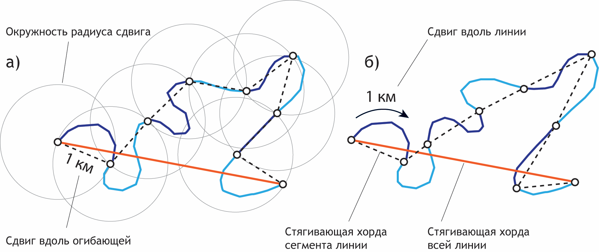
```

